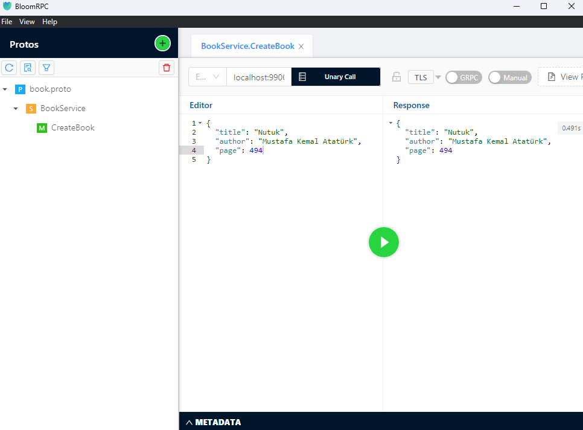
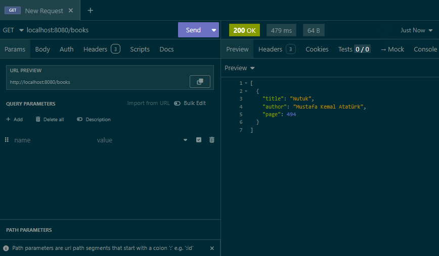
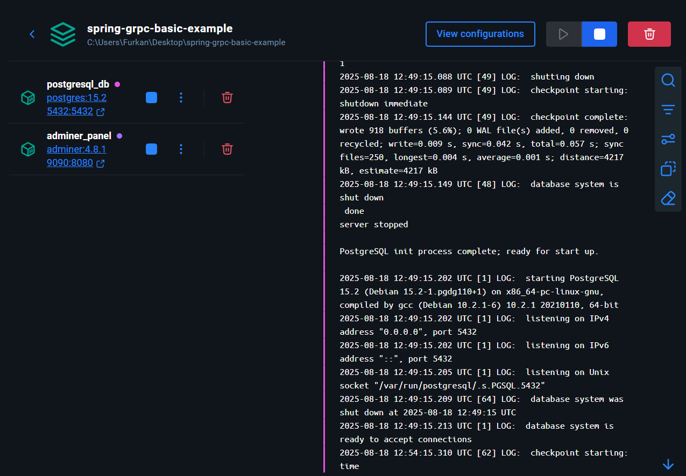

## 👛 `Spring GRPC Service Example`

<br>

<div align="center">

</div>

---

<div align="center">

</div>

---

<div align="center">

</div>

<br>

- ✅ Spring GRPC Service Example

<br>

Used Technologies in The Project:

[](https://www.java.com/en/)
[](https://spring.io/)
[](https://www.postgresql.org/)
[](https://gradle.org/)
[](https://grpc.io/)
[](https://docs.docker.com/)

<br>

### Installation

```shell
git clone https://github.com/furkankayam/spring-grpc-service-example.git
```

<br>

### Usage

```shell
docker-compose up -d
```

```shell
gradle bootRun
```

<br>

### URL

```bash
http://localhost:8080/books
```

<br>

<br>

# License

This project is licensed under the MIT License. See the [LICENSE](LICENSE) file for details
